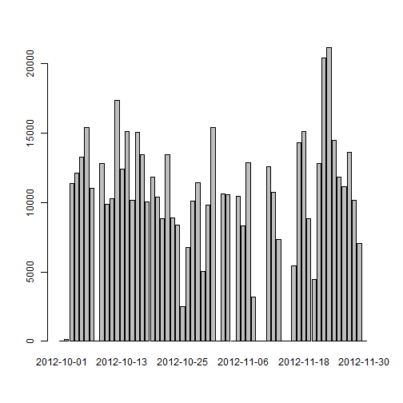
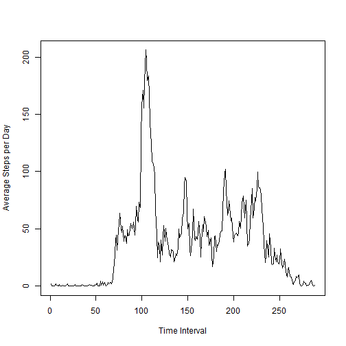
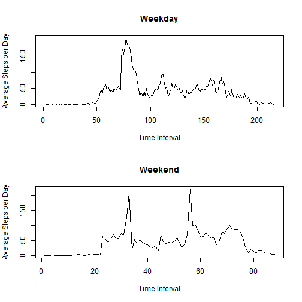

Reproducible Research: Peer Assessment Assignment 1
=======================================================

### Part 1.)


First let us read the in the date


```r
ActivData <- read.csv("activity.csv")
ActivData[, 2] <- as.Date(as.character(ActivData[, 2]))
```


Now we will split the date frame into a list where each item in the list corresponds to the data coming from a single day.


```r
Datalist1 <- split(ActivData, f = ActivData$date)
```


Next we write a function which will sum the first column of a data frame.


```r
FirstColSum1 <- function(df) {
    tot <- sum(df[, 1], na.rm = TRUE)
    return(tot)
}
```


We now apply the previous function to our list of dataframes to get a vector containing the number of steps for each day. 


```r
TotalStep1 <- sapply(Datalist1, FirstColSum1)
```


Next we make a bar plot (histogram) of this data. 


```r
barplot(TotalStep1)
```

 


Finally, we calculate the mean and median number of steps per day from our data. 


```r
MeanTS <- mean(TotalStep1)
MedTS <- median(TotalStep1)
```


The mean number of steps per day is 9354.2295 and the median number of steps per day
is 10395. 


### Part 2.)

For the second part we again split the origin dataframe. However we know split it into a list such that each dataframe in the list corresponds to a specific time interval.

```r
Datalist2 <- split(ActivData, f = ActivData$interval)
```


We write a new function that calculate the mean of the first column of a dataframe.


```r
FirstColMean <- function(df) {
    tot <- mean(df[, 1], na.rm = TRUE)
    tot2 <- tot
    return(tot)
}
```


We now apply this function to each dataframe in our list to get a vector containing the average number of steps during each time interval.


```r
TotalStep2 <- sapply(Datalist2, FirstColMean)
```


Now we use this data to make a time series plot. 


```r
plot(1:288, TotalStep2, xlab = "Time Interval", ylab = "Average Steps per Day", 
    type = "l")
```

 


Finally, we extract the time interval where the average steps is the largest.

```r
x <- names(which.max(TotalStep2))
```


The max average steps per days occurs at time interval 835.


### Part 3.)

First we calculate the total number of NA's in our data set.


```r
NAVect <- is.na(ActivData[, 1])
NAVect <- as.numeric(NAVect)
TotalNA <- sum(NAVect)
```


The total number of NA values is 2304. 

Now we replace the NA's. Specifically, if there is an NA value in a row with a specific time interval, then we replace the NA with the average number of steps for that time interval as calculated in Part 2.)


```r
ReplaceData <- as.numeric(TotalStep2)
```


```r
i <- 1
for (i in 1:288) {
    Datalist2[[i]][is.na(Datalist2[[i]])] <- ReplaceData[i]
    
}
```


```r
ActivDataNoNA <- do.call(rbind, Datalist2)
```


Now we once again split the data set as in Part 1.) and create a histogram.


```r
Datalist1NoNA <- split(ActivDataNoNA, f = ActivDataNoNA$date)
```


```r
TotalStep1NoNA <- sapply(Datalist1NoNA, FirstColSum1)
```


```r
barplot(TotalStep1NoNA)
```

 


Finally, we calculate the new mean and median number of steps per day from our data. 


```r
MeanTSNoNA <- mean(TotalStep1NoNA)
MedTSNoNA <- median(TotalStep1NoNA)
```


The new mean number of steps per day is 1.0766 &times; 10<sup>4</sup> and the median number of steps per day
is 1.0766 &times; 10<sup>4</sup>.

Comparing the number recall that the original mean was 9354.2295 and the original median was 10395. 


### Part 4.)

First, we extract the data of on which days of the week the measurement occurs. 


```r
days <- weekdays(ActivData[, 2])
```


We create a variable DOW, standing for Day of Week, that classifies each day as a weekday or a weekend. 


```r
DOW <- 1
for (i in 1:17568) {
    if (days[i] == "Saturday") {
        DOW[i] <- "weekend"
    } else if (days[i] == "Sunday") {
        DOW[i] <- "weekend"
    } else {
        DOW[i] <- "weekday"
    }
}
```


We combined this data into the dataframe from 3 with no NA's and split it to get a dataframe consisting of only measurements taken on weekdays, and we do the same for measurements taken on weekends. 


```r
DataWithDay <- cbind(ActivDataNoNA, DOW)
Datalist3 <- split(DataWithDay, f = DataWithDay$DOW)
```


```r
WeekdayData <- Datalist3[[1]]
WeekendData <- Datalist3[[2]]
```


We now split each of these dataframes based on the time interval. Then average all days to get our final data set.


```r
WeekdayList <- split(WeekdayData, f = WeekdayData$interval)
```


```r
WeekdayFinal <- sapply(WeekdayList, FirstColMean)
```


```r
WeekendList <- split(WeekendData, f = WeekendData$interval)
```


```r
WeekendFinal <- sapply(WeekendList, FirstColMean)
```


Now we use this data to make a time series plot. 


```r
par(mfrow = c(2, 1))
plot(1:216, WeekdayFinal, main = "Weekday", xlab = "Time Interval", ylab = "Average Steps per Day", 
    type = "l")
plot(1:88, WeekendFinal, main = "Weekend", xlab = "Time Interval", ylab = "Average Steps per Day", 
    type = "l")
```

 

